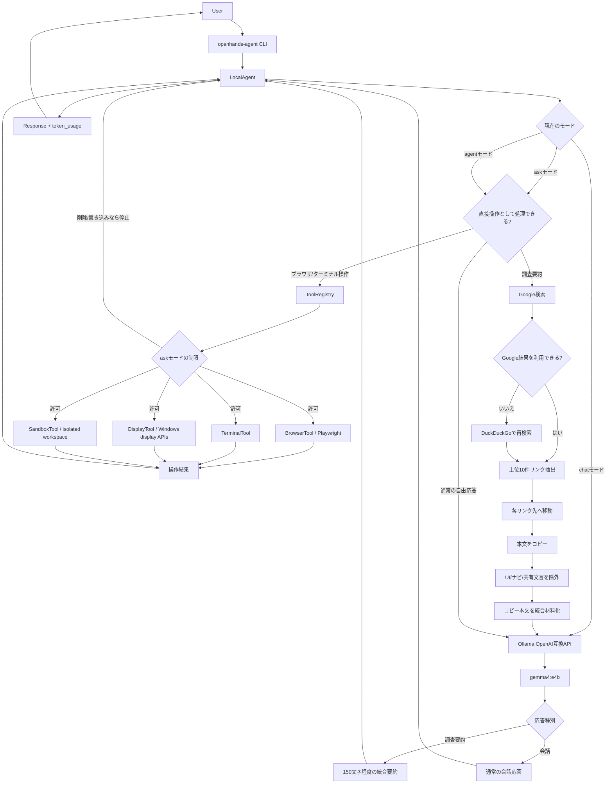

# OpenHands Local Agent

OpenAI SDK を Ollama の OpenAI 互換 API に向けて使い、ローカルの `gemma4:e4b` からブラウザ、ターミナル、ディスプレイ、サンドボックス操作を呼び出せる拡張可能な AI エージェントです。

## セットアップ

```powershell
python -m venv .venv
.\.venv\Scripts\Activate.ps1
pip install -e .
playwright install chromium
Copy-Item .env.example .env
```

Ollama 側でモデルを用意します。モデル名が異なる場合は `.env` の `OLLAMA_MODEL` を変更してください。

```powershell
ollama serve
ollama pull gemma4:e4b
```

## 実行

```powershell
openhands-agent
```

3つのモードを切り替えられます。既定はエージェントモードです。

```powershell
/mode chat
/mode ask
/mode agent
askモードにして
エージェントモードにして
```

`chat` モードはツールや定型処理を使わず、入力をLLMへそのまま渡します。`ask` モードは検索、読み取り、状態確認を行えますが、ファイルの削除や書き込みを伴う操作を制限します。`agent` モードはブラウザ、ターミナル、ディスプレイ、サンドボックス操作を制限なしで実行できます。

単発指示:

```powershell
openhands-agent "https://example.com を開いてページタイトルを確認して"
```

よく使う直接操作:

```powershell
openhands-agent "open browser"
openhands-agent "open https://example.com"
openhands-agent "OpenAI SDKを検索して"
openhands-agent "インテルについて調べて要約して"
openhands-agent "PythonでCSVを読むコードを生成して"
openhands-agent "codegen: fizzbuzz in JavaScript"
openhands-agent "ディスプレイを拡張して"
openhands-agent "ディスプレイを複製して"
openhands-agent "画面を暗くして"
openhands-agent "画面を明るくして"
openhands-agent "明るさを70にして"
openhands-agent "解像度を1920x1080にして"
openhands-agent "解像度を下げて"
openhands-agent "画面の向きを縦にして"
openhands-agent "サンドボックスの場所を教えて"
openhands-agent "sandbox: python --version"
openhands-agent "terminal: Get-Location"
```

検索操作はまずGoogleで実行し、Google側の自動操作判定などで結果表示が完了しない場合はDuckDuckGoで再検索します。

コード生成依頼は専用プロンプトで処理します。`コード生成:` / `codegen:` で明示するか、`コードを生成して`、`プログラムを書いて`、`サンプルコード` のように依頼できます。生成したコードは `.agent_sandbox/generated/` に保存し、Python、JavaScript、HTML は可能な範囲で実行確認します。`create tetris`、`creat tetris`、`テトリスゲームを作って` は、ブラウザで動くテトリスを生成して開きます。生成後はメモリーに成果物を記録するため、同じREPL内で `テトリスを実行して`、`もう一度開いて` のように続きの操作ができます。再起動後も `.agent_sandbox/generated/tetris/index.html` が残っていればテトリスを再実行できます。

`調べて要約して` のような調査依頼では、まずGoogleでキーワード検索し、上位10件のリンク先に移動して本文を読み込みます。各ページでは要約せず本文をコピーし、最後の統合時だけLLMで150文字程度へ要約します。

ディスプレイ操作はWindowsで動作します。複数ディスプレイの拡張・複製、PC画面のみ、外部画面のみ、明るさ、解像度、画面の向きを操作できます。明るさは対応モニターのみ変更できます。

コーディングやツール動作確認には `.agent_sandbox/` 配下だけを使うサンドボックスを利用できます。`sandbox: <command>` でサンドボックス内のコマンドを実行し、`delete .agent_sandbox/generated/tetris` のようにサンドボックス内の指定パスだけを削除できます。`サンドボックスをリセットして` で内容全体を削除できます。`ask` モードでは `sandbox` の `write`、`delete`、`reset`、危険な書き込み・削除コマンドを制限します。

## アーキテクチャ



## 軽量化設定

描画が重い場合は `.env` の設定を調整します。既定では表示ブラウザを使いながら、画像・動画・フォントの読み込みを止めて負荷を下げています。

```dotenv
OLLAMA_NUM_CTX=131072
OLLAMA_TEMPERATURE=0.2
OLLAMA_MAX_TOKENS=800
BROWSER_LIGHT_MODE=true
BROWSER_BLOCK_RESOURCES=image,media,font
BROWSER_VIEWPORT_WIDTH=1024
BROWSER_VIEWPORT_HEIGHT=720
AGENT_MAX_STEPS=6
AGENT_HISTORY_LIMIT=0
AGENT_TRACE=true
```

ページの見た目確認を優先する場合は `BROWSER_BLOCK_RESOURCES=` を空にしてください。さらに軽くしたい場合は `BROWSER_HEADLESS=true` にするとブラウザ表示なしで操作します。

`gemma4:e4b` のローカルモデル情報では context length が `131072` なので、既定で `OLLAMA_NUM_CTX=131072` を指定しています。`AGENT_HISTORY_LIMIT=0` は会話履歴の自動削除を無効にします。

`AGENT_TRACE=true` にすると、内部推論ではなく、ステップ進行・ツール呼び出し・ツール結果のトレースを表示します。

応答末尾には `[tokens]` としてモデル呼び出しの合計トークン数を表示します。Ollama側が `usage` を返さない直接操作だけの処理では `unavailable` になります。

## 拡張方法

新しい操作を増やすときは `src/openhands_agent/tools/base.py` の `Tool` を継承し、`src/openhands_agent/cli.py` の `build_agent()` で `ToolRegistry` に登録します。

ツールは OpenAI Chat Completions の function tool schema と同じ形で LLM に公開されます。Ollama やモデルの tool calling 対応に差があるため、この実装では function tool call に加えて、JSON 形式の手動ツール指定も受け付けます。

内部構成は、SOLID原則に寄せて責務を分けています。

- `agent.py`: 会話ループ、モード制御、LLM呼び出しの調停
- `models.py`: `AgentResponse`、`TokenUsage`、メモリー成果物などのデータモデル
- `command_parsers.py`: 四則演算、コード生成、サンドボックス操作などの直接コマンド解析
- `mcp_context.py`: MCP風のツール実行境界。ツール呼び出し、制限ポリシー、実行結果を一箇所で扱います
- `tools/`: ブラウザ、ターミナル、ディスプレイ、サンドボックスなどの具体ツール実装
